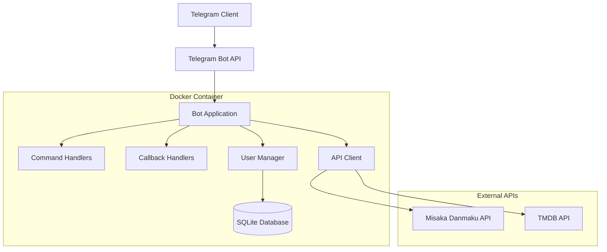

# Telegram 弹幕控制机器人设计文档

## 概述

本项目是一个基于 Telegram Bot API 的弹幕系统控制机器人，用于通过 Telegram 界面远程控制 Misaka 弹幕系统。机器人将提供直观的按钮式交互界面，支持弹幕管理、状态监控、TMDB 电影信息查询等功能，并以 Docker 容器形式部署到 VPS 上。

### 核心功能
- 弹幕系统状态监控
- 弹幕内容管理和控制
- TMDB 电影信息查询集成
- 用户权限管理
- 实时日志查看

### 技术栈
- **运行时**: Python 3.9+
- **Bot框架**: python-telegram-bot
- **HTTP客户端**: aiohttp/requests
- **数据库**: SQLite (用户管理)
- **容器化**: Docker + Docker Compose
- **部署环境**: VPS (Linux)

## 架构设计

### 系统架构图



### 核心组件

#### 1. Bot Application (`bot.py`)
主应用程序，负责：
- 初始化 Telegram Bot
- 注册命令和回调处理器
- 管理应用生命周期
- 错误处理和日志记录

#### 2. Command Handlers (`handlers/commands.py`)
处理用户命令：
- `/start` - 欢迎界面和主菜单
- `/status` - 弹幕服务器状态
- `/help` - 帮助信息
- `/admin` - 管理员功能（权限控制）

#### 3. Callback Handlers (`handlers/callbacks.py`)
处理内联键盘回调：
- 弹幕控制按钮
- 分页导航
- 设置修改
- 确认对话框

#### 4. API Client (`clients/api_client.py`)
外部 API 集成：
- Misaka 弹幕 API 封装
- TMDB API 集成
- 请求重试和错误处理
- 响应数据格式化

#### 5. User Manager (`managers/user_manager.py`)
用户权限管理：
- 用户注册和认证
- 权限级别控制
- 使用统计记录

## 功能模块设计

### 主菜单界面
```
🎮 弹幕控制中心

📊 服务器状态     🎬 电影搜索
🎯 弹幕管理       ⚙️ 设置
📋 操作日志       ❓ 帮助
```

### 服务器状态模块
**功能描述**: 显示弹幕服务器的实时状态信息

**界面设计**:
```
📊 服务器状态

🟢 在线 | CPU: 45% | 内存: 1.2GB
连接数: 1,245 | 弹幕数: 15,672

[🔄 刷新] [📈 详细信息] [🏠 返回主菜单]
```

**API 调用**:
- `GET /api/control/status?api_key={API_KEY}`

### 弹幕管理模块
**功能描述**: 管理弹幕内容和显示设置

**界面设计**:
```
🎯 弹幕管理

当前状态: 🟢 启用
显示速度: 普通 | 透明度: 80%

[⏸️ 暂停弹幕] [🚫 清空弹幕]
[⚙️ 显示设置] [🎨 样式设置]
[🏠 返回主菜单]
```

**子功能**:
- 弹幕开关控制
- 弹幕清空
- 显示参数调整
- 样式模板选择

### 电影搜索模块
**功能描述**: 集成 TMDB API 提供电影信息查询

**界面设计**:
```
🎬 电影搜索结果

🎭 阿凡达 (2009)
⭐ 7.8/10 | 🎬 科幻/动作
📝 在潘多拉星球上，杰克·萨利...

[📄 详细信息] [🎯 发送弹幕] [🔍 搜索其他]
```

**API 集成**:
- TMDB 搜索 API
- 电影详情获取
- 海报图片显示

### 管理员功能模块
**功能描述**: 仅管理员可访问的高级功能

**权限控制**:
- 用户白名单管理
- 系统设置修改
- 日志查看
- 紧急停止功能

## 数据库设计

### 用户表 (users)
```sql
CREATE TABLE users (
    id INTEGER PRIMARY KEY,
    telegram_id BIGINT UNIQUE NOT NULL,
    username TEXT,
    first_name TEXT,
    role TEXT DEFAULT 'user',
    created_at TIMESTAMP DEFAULT CURRENT_TIMESTAMP,
    last_active TIMESTAMP,
    is_active BOOLEAN DEFAULT TRUE
);
```

### 操作日志表 (operation_logs)
```sql
CREATE TABLE operation_logs (
    id INTEGER PRIMARY KEY AUTOINCREMENT,
    user_id BIGINT NOT NULL,
    operation TEXT NOT NULL,
    parameters TEXT,
    result TEXT,
    timestamp TIMESTAMP DEFAULT CURRENT_TIMESTAMP,
    FOREIGN KEY (user_id) REFERENCES users(telegram_id)
);
```

## API 集成规范

### Misaka 弹幕 API
**基础配置**:
- Base URL: `http://154.12.85.19:7768`
- API Key: `jt8kjydaKqnn0y6pjr0UiX273PZKXWFq`
- 认证方式: URL 参数 `?api_key={key}`

**主要端点**:
```python
# 获取状态
GET /api/control/status?api_key={api_key}

# 控制弹幕
POST /api/control/danmaku?api_key={api_key}
{
    "action": "pause|resume|clear",
    "settings": {
        "speed": "slow|normal|fast",
        "opacity": 0.8
    }
}
```

### TMDB API
**配置信息**:
- API Key: `6e502611fd4c1608f8211ead0b864312`
- Base URL: `https://api.themoviedb.org/3`
- Image URL: `https://image.tmdb.org`

**搜索端点**:
```python
# 电影搜索
GET /search/movie?api_key={key}&query={query}&language=zh-CN

# 电影详情
GET /movie/{movie_id}?api_key={key}&language=zh-CN
```

## 错误处理策略

### API 错误处理
```python
class APIError(Exception):
    def __init__(self, status_code, message):
        self.status_code = status_code
        self.message = message

async def handle_api_error(error):
    if error.status_code == 401:
        return "❌ API 密钥无效，请联系管理员"
    elif error.status_code == 503:
        return "⚠️ 服务暂时不可用，请稍后重试"
    else:
        return f"❌ 操作失败: {error.message}"
```

### 用户权限错误
```python
@require_permission("admin")
async def admin_command(update, context):
    # 管理员功能实现
    pass
```

## 安全考虑

### 1. API 密钥管理
- 使用环境变量存储敏感信息
- 不在代码中硬编码密钥
- 定期轮换 API 密钥

### 2. 用户权限控制
- 实现基于角色的访问控制 (RBAC)
- 管理员功能需要额外验证
- 记录所有操作日志

### 3. 输入验证
- 验证用户输入格式
- 防止 SQL 注入
- 限制请求频率

## 部署配置

### Docker 配置

#### Dockerfile
```dockerfile
FROM python:3.9-slim

WORKDIR /app

COPY requirements.txt .
RUN pip install --no-cache-dir -r requirements.txt

COPY . .

CMD ["python", "bot.py"]
```

#### docker-compose.yml
```yaml
version: '3.8'

services:
  telegram-bot:
    build: .
    container_name: danmaku-telegram-bot
    restart: unless-stopped
    environment:
      - BOT_TOKEN=${BOT_TOKEN}
      - DANMAKU_API_KEY=${DANMAKU_API_KEY}
      - TMDB_API_KEY=${TMDB_API_KEY}
      - DATABASE_URL=sqlite:///data/bot.db
    volumes:
      - ./data:/app/data
      - ./logs:/app/logs
    networks:
      - bot-network

networks:
  bot-network:
    driver: bridge
```

#### 环境变量配置 (.env)
```bash
BOT_TOKEN=8214946947:AAE6LQ6ALn3Ae06Y0HRytrlhW2t-1yHRuj8
DANMAKU_API_KEY=jt8kjydaKqnn0y6pjr0UiX273PZKXWFq
TMDB_API_KEY=6e502611fd4c1608f8211ead0b864312
DANMAKU_BASE_URL=http://154.12.85.19:7768
TMDB_BASE_URL=https://api.themoviedb.org/3
LOG_LEVEL=INFO
ADMIN_USER_IDS=123456789,987654321
```

### VPS 部署教程

#### 1. 服务器准备
```bash
# 更新系统
sudo apt update && sudo apt upgrade -y

# 安装 Docker
curl -fsSL https://get.docker.com -o get-docker.sh
sudo sh get-docker.sh

# 安装 Docker Compose
sudo apt install docker-compose -y

# 创建项目目录
mkdir -p ~/danmaku-bot
cd ~/danmaku-bot
```

#### 2. 项目部署
```bash
# 克隆或上传项目文件
git clone <your-repo-url> .
# 或者使用 scp 上传文件

# 配置环境变量
cp .env.example .env
nano .env  # 编辑配置文件

# 创建数据目录
mkdir -p data logs

# 构建并启动容器
docker-compose up -d

# 查看运行状态
docker-compose ps
docker-compose logs -f
```

#### 3. 服务管理
```bash
# 停止服务
docker-compose down

# 重启服务
docker-compose restart

# 更新服务
git pull
docker-compose build --no-cache
docker-compose up -d

# 查看日志
docker-compose logs -f telegram-bot
```

#### 4. 维护脚本
```bash
#!/bin/bash
# update-bot.sh
cd ~/danmaku-bot
git pull
docker-compose down
docker-compose build --no-cache
docker-compose up -d
echo "Bot updated successfully!"
```

## 测试策略

### 单元测试
- 测试 API 客户端功能
- 测试用户权限验证
- 测试数据库操作
- 测试消息格式化

### 集成测试
- 测试 Telegram Bot API 集成
- 测试外部 API 调用
- 测试端到端用户流程

### 部署测试
- Docker 容器启动测试
- 环境变量配置测试
- 网络连接测试
- 持久化数据测试

## 监控和日志

### 日志配置
```python
import logging

logging.basicConfig(
    format='%(asctime)s - %(name)s - %(levelname)s - %(message)s',
    level=logging.INFO,
    handlers=[
        logging.FileHandler('/app/logs/bot.log'),
        logging.StreamHandler()
    ]
)
```

### 健康检查
```python
async def health_check():
    try:
        # 检查弹幕 API 连接
        await danmaku_client.get_status()
        # 检查数据库连接
        await db.execute("SELECT 1")
        return True
    except Exception as e:
        logger.error(f"Health check failed: {e}")
        return False
```

### 性能监控
- API 响应时间监控
- 用户请求频率统计
- 内存和 CPU 使用监控
- 错误率统计

## 扩展功能规划

### 1. 高级弹幕功能
- 弹幕样式自定义
- 弹幕内容过滤
- 用户弹幕历史
- 弹幕数据分析

### 2. 多媒体支持
- 图片弹幕发送
- 语音消息转弹幕
- GIF 动图支持

### 3. 社交功能
- 用户群组管理
- 弹幕评论系统
- 点赞和举报功能

### 4. 自动化功能
- 定时弹幕发送
- 事件触发器
- Webhook 集成